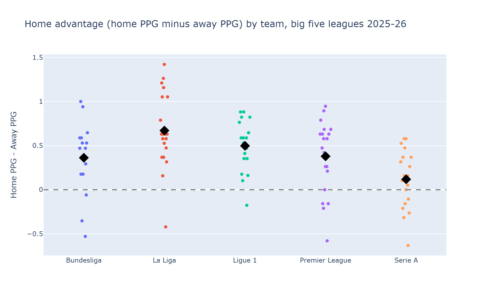

# Is Home Advantage Equal Across Europe's Top Five Leagues?

Every football fan has heard the idea that playing at home gives a team an edge - the crowd, no
travel, a familiar pitch. But is that edge the same everywhere, or does it depend on which league
you're watching? I compared the 2025-26 season of the Premier League, La Liga, Bundesliga, Serie A
and Ligue 1 to find out, using match results collected from the [football-data.org](https://www.football-data.org/)
API.

## What I measured

For every team, I compared the points it earned per game at home against the points it earned per
game away, across the whole season. If a team averages the same points at home and away, it gets no
measurable benefit from playing at home; the bigger the gap, the stronger the home effect.

## What I found

**1. Home advantage is real almost everywhere, but its size depends heavily on the league.**
La Liga has the strongest home effect of the five: on average, teams pick up 0.67 more points per
game at home than away, and 19 of its 20 teams (95%) are favoured at home. Serie A sits at the other
end - a much smaller average gap of 0.12 points per game, with only 13 of its 20 teams (65%) doing
better at home than away.

*Each dot is one team's home-away points gap; the black diamond marks each league's average. Notice
how spread out the dots are within every league - the average alone doesn't tell the whole story.*

**2. Even in leagues with a strong home effect, it's not automatic for every team.** In every one of
the five leagues, at least one team actually performed *better* away than at home over the season -
home advantage is a strong tendency across a league, not a guarantee for any individual club.

**3. The effect shows up in the goalscoring too, not just the results.** Teams with a bigger home-away
points gap also tend to have a bigger home-away gap in goal difference (the two are correlated at
0.82) - so this isn't just about picking up lucky draws at home. Teams that do better at home are
generally also winning by more.

## Why this happens

Sports researchers who study home advantage generally point to a mix of factors: crowd support, no
travel fatigue, familiarity with the pitch, and even a documented tendency for referees to make
marginally more favourable calls for the home side under crowd pressure. This dataset can't separate
those causes from each other, but the size of the gap - and how much it varies by league - is
consistent with home advantage being a real, measurable effect rather than a myth.

*Full analysis, data collection code, and reproducibility instructions: see the
[project repository](https://github.com/martinezmerino/me204-final-project).*
